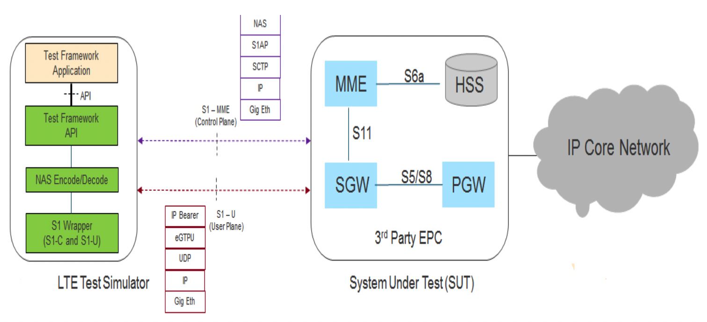
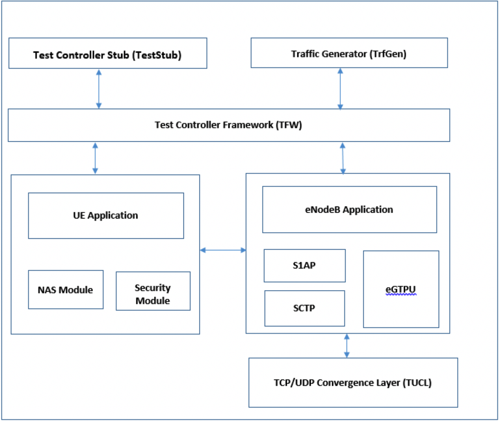

# Introduction
S1APTester implements a UE(s) and eNodeB simulator for LTE Radio Access Networks
(RAN). The S1APTester is used to validate S1-C and S1-U Interfaces to an LTE
EPC.
It provides hooks for generating control and user plane procedures on the S1
Interface.

S1APTester is currently used as the S1 testing engine for the following
projects:
- [Magma](https://github.com/facebookincubator/magma): An open-source software
platform that gives network operators an open, flexible and extendable mobile
core network solution.

# Architecture
The Network Architecture of S1APTester is shown below



The S1APTester product contains the following components:



* Test Controller Framework (tfwApp)
  *	Exposes APIs towards the Test Controller Stub
  *	Responsible for configuring and interacting with UE Application and EnodeB
  Application layers
* UE Application (ueApp)
  *	Simulates the UE
  *	Maintains UE related configuration and call processing data. Also has state
  machines per UE
  *	Has NAS codec and security modules to build the NAS messages
* EnodeB Application (enbApp)
  *	Simulates the EnodeB functionality
  *	Maintains S1 Connection details
  *	Has S1AP and eGTP protocol stacks.
  *	Has TUCL Convergence layer, implements TCP and UDP layers
  *	Responsible for setting up of S1 Control and User plane
* Traffic Generator (Trfgen)
  *	Provides API for trigerring User plane traffic over LTE bearers of a
  simulated UE.
  *	It uses Iperf3 for traffic generation
* Test Controller Stub (TestStub)
  *	Contains example test cases which use the APIs provided by test framework
  for simulating various control and user plane procedures.
  *	Triggers various test case events towards Test Controller Framework (TFW)
  *	Receives and processes events from TFW


#	Compilation of S1APTester modules
S1APTester binary can be generated by executing below compilation steps:
## Compile S1SIM Application
```
$ cd TestCntlrApp/build
$ make cleanall
$ make
```
On successful compilation, the “libtfw.so” library gets generated under
TestCntlrApp/lib folder.

##	Compile Traffic Generator
```
$ cd Trfgen/build
$ make clean
$ make
```
On successful compilation, the “libtrfgen.so” library gets generated under
Trfgen/lib folder.

## License

S1APTester is BSD License licensed, as found in the LICENSE file.
